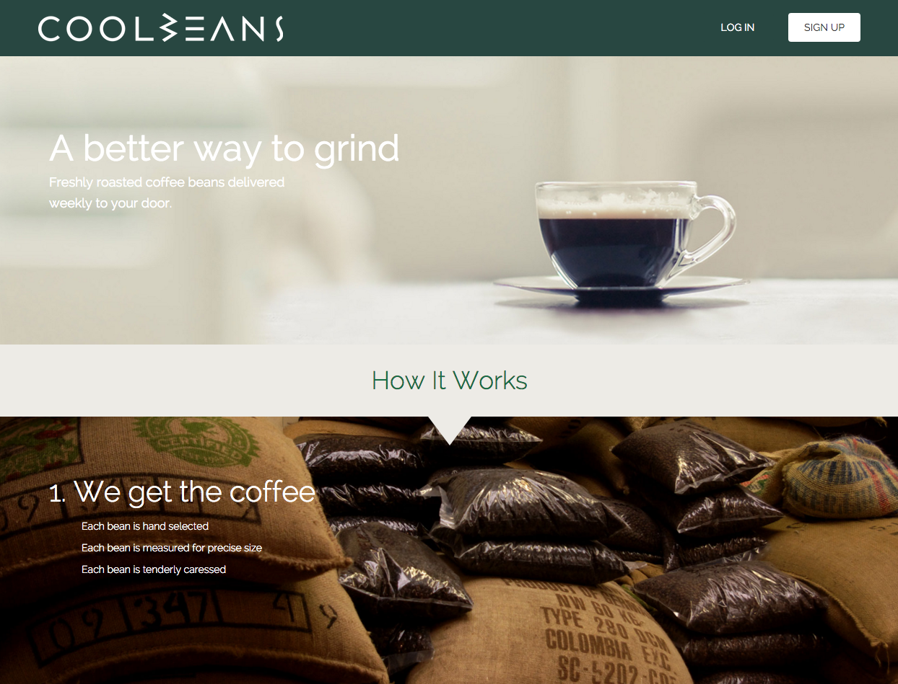
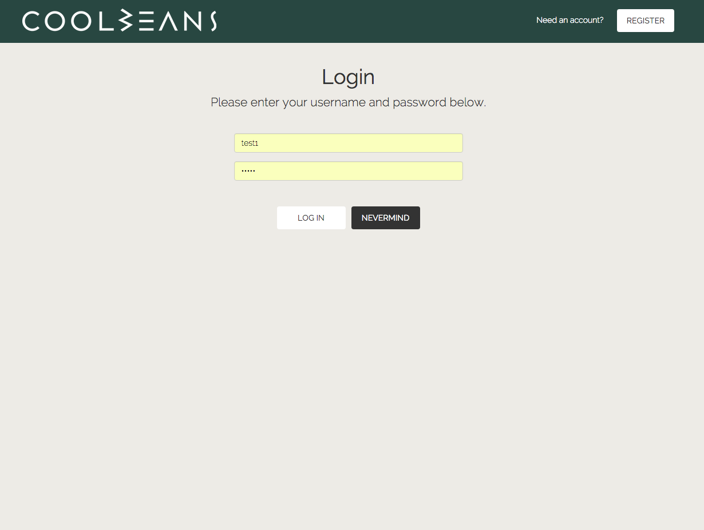
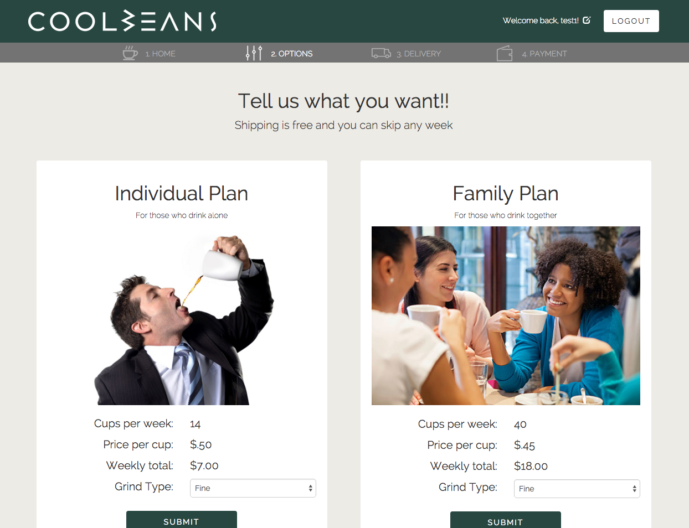
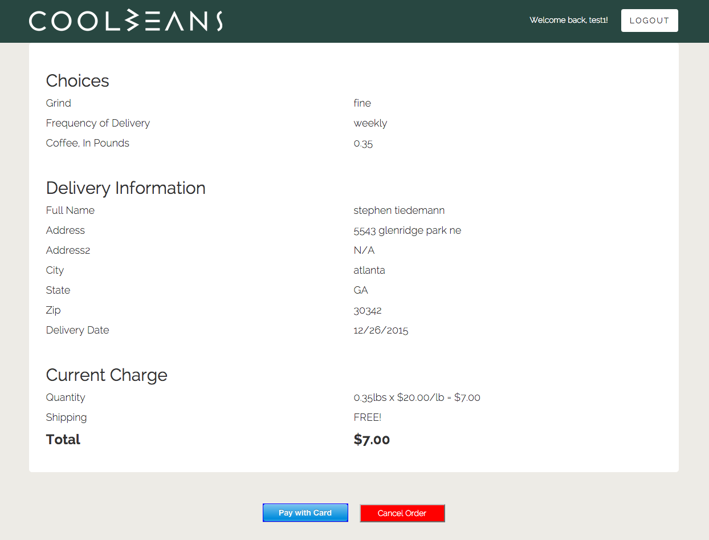
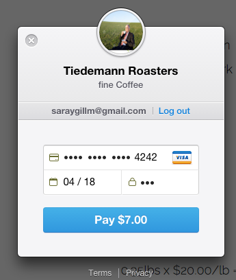

#Ecommerce Coffee Site - Built with Node.js

This is my most comprehensive project built using node.js.  Combines the use of node with Express, Mongoose, MondoDb.  The site is setup as a store where a customer can order coffee. There are pages to login and register with user information being stored in a MongoDb database. Once a customer makes a selection those choices are stored in the database. The site makes heavy use of form control to insure no possible errors. Payments are possibly through integration with the Stripe payment system.  

https://stephenscoffee.herokuapp.com/intro

